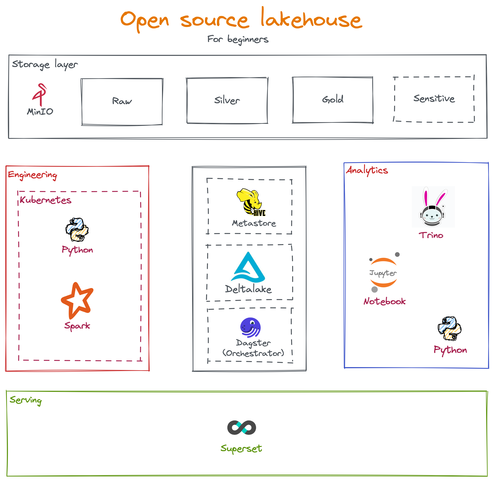

**[WIP]**
# Open source stack for lakehouse
This project to POC of a simple lakehouse architecture which aims to:
- Learning: If you are students or beginner who are working with data everyday then this project could helps you to understand the tools that you are working on.
- Cloud deputize testing: Nowaday, cloud services are easily to plug-and-play but there is various of tools and each of them have its own advantage as well as disadvantage that you have to take aware of. Almost of them are built on top open source stack so this project ifself is a cloud at your home!

There will be no fixed deployment kind but each service is revolve around cloud-native application (containerized) which use can easily to integrate/test with your current platform.

*Note*: This project scope will not cover on security feature of lakehouse (data, table, row,...) access control, resource management.

# Architecture

# Setup:
## Hive metastore:
- [Hive metastore quick setup](https://github.com/leehuwuj/olh/blob/main/hive-metastore/README.md)
## Trino
- [Trino quick setup](https://github.com/leehuwuj/olh/blob/main/trino/README.md)
## Spark
- [Spark simple setup for Kubernetes](https://github.com/leehuwuj/olh/blob/main/spark/README.md)

# Practices
## Tweets Champions
- [Tweets Data](https://github.com/leehuwuj/olh/blob/main/resources/data/README.md)
- Examples:
    - [Pyspark - Tweets Fact ingestion](https://github.com/leehuwuj/olh/tree/main/resources/practices/tweetschampions)