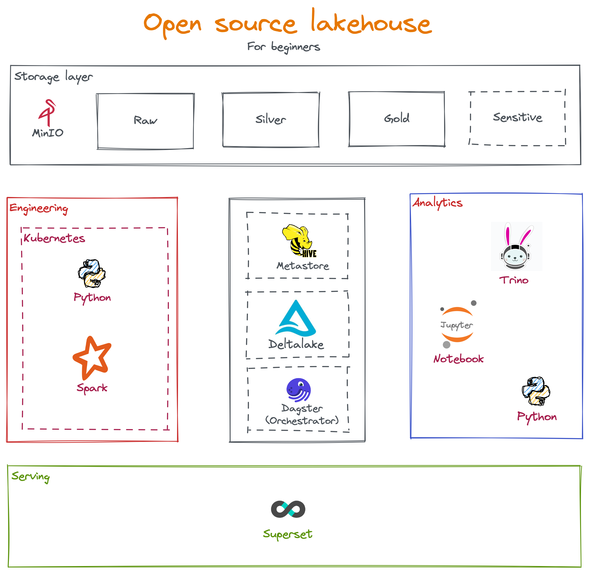

# Open source stack for lakehouse
This project to POC of a simple lakehouse architecture which aims to:
- Learning: If you are students or beginner who are working with data everyday then this project could helps you to understand the tools that you are working on.
- Cloud deputize testing: Nowaday, cloud services is easy to plug-and-play but there is various of tools and each of them have its own advantage as well as disadvantage that you have to take aware of. Almost of them are built on top open source stack so this project ifself is a cloud at your home!

# Architecture

