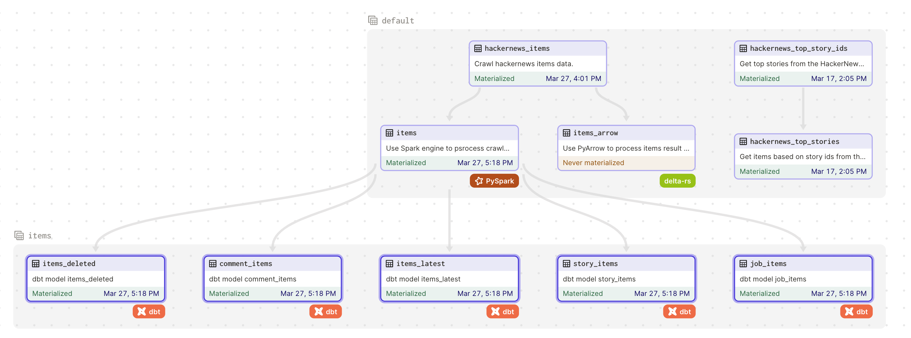

## Prerequisite:
At this point, we will combine all step into an dagster project which define an workflow for our projects. Please make sure you have already setup these tools:
- Spark k8s cluster
- Trino cluster
- DBT

## Dagster setup:
Basically, dagster project can be flexibly deployed into different environment, we should organize our project code to use environment variable that can easily change based on the deployment.  
### Development (locally deploy):
1. Install python packages by Poetry:
```
poetry install
```

2. Check & update the environment variables in the `__init__.py` of hackernews project.
```
S3_ENDPOINT = os.environ.get("AWS_S3_ENDPOINT_URL")
AWS_ACCESS_KEY_ID= os.environ.get("AWS_ACCESS_KEY_ID")
AWS_SECRET_ACCESS_KEY = os.environ.get("AWS_SECRET_ACCESS_KEY")

SPARK_CLUSTER = os.environ.get("SPARK_CLUSTER", "k8s://https://host.docker.internal:8443")
SPARK_METASTORE = os.environ.get("SPARK_METASTORE", "thrift://host.docker.internal:9083")
# Please set this to your dagster host IP that the network from k8s cluster can connect to
SPARK_DRIVER_HOST = os.environ.get("SPARK_DRIVER_HOST")

DBT_HOME = os.environ.get("DBT_HOME")

DBT_PROJECT_PATH = os.path.join(DBT_HOME, "olh/dbt/hackernews")
DBT_PROFILES = os.path.join(DBT_HOME, "olh/dbt/hackernews")
```

3. Start **dagit** UI:
```
poetry run dagit
```

4. Trigger hackernews assets:

