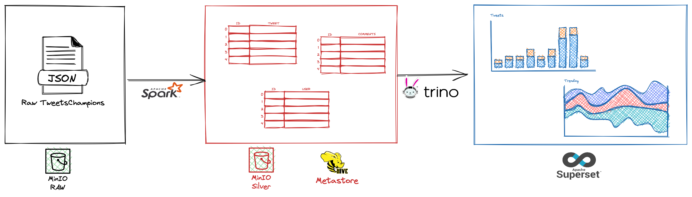

## Flow

## Data:
- [Tweets Data](https://github.com/leehuwuj/olh/blob/main/resources/data/README.md)

## Practice steps (manually):
1. Ingest raw json data into MinIO at raw path.
    - Download data from above link and upload into raw space in MinIO lake bucket.
    - You can also create a simple download and upload script in Python which is represent for a data integration.
2. Submit `pyspark_tweets_fact_ingesting.py` to filter out tweet information into `tweet_fact` table.
    - Upload the pyspark script into an S3 script resources bucket.
    - Edit the configuration in `submit.sh` and run it.
3. Testing table data in Trino.  
    - Do adhoc query in Trino to check the table and data quality for above pipeline
    - // Todo  
3. Create Superset dashboard.
    - // Todo

## Dagster (automatically):
// Todo